<p align="center">
  
</p>

<p align="center">
  <a href="https://www.linkedin.com/in/hem-patel-02b215377/">linkedin</a> ·
  <a href="mailto:patelhem60@gmail.com">patelhem60@gmail.com</a>
</p>

### Work

| Repo | Commits | About |
|---|---|---|
| [RAG-CHAT-BOT](https://github.com/Hem60/RAG-CHAT-BOT) | 2 commits | Python · retrieval-augmented generation chatbot |
| [webathon](https://github.com/Hem60/webathon) | 5 commits | HTML · hackathon build |
| [IRIS-PREDICTOR](https://github.com/Hem60/IRIS-PREDICTOR) | 4 commits | HTML · classic ML classification project |
| [MOVIE_RECOMMENDER](https://github.com/Hem60/MOVIE_RECOMMENDER) | 1 commit | HTML · movie recommendation app |
| raksha-ai *(private)* | 5 commits (contributor) | Team project — financial safety AI assistant · built the About/How it works screen |

### Stack

```
languages   Python · HTML · CSS · JavaScript
ai/ml       RAG pipelines · LLMs · embeddings · vector search
tools       Git · GitHub · VS Code · Claude Code · Gemini CLI · Copilot
learning    ML fundamentals · applied AI/ML projects
```

<sub>B.E. Computer Engineering · IIT Mandi (AI-DS) — two undergraduate degrees, in parallel.</sub>
